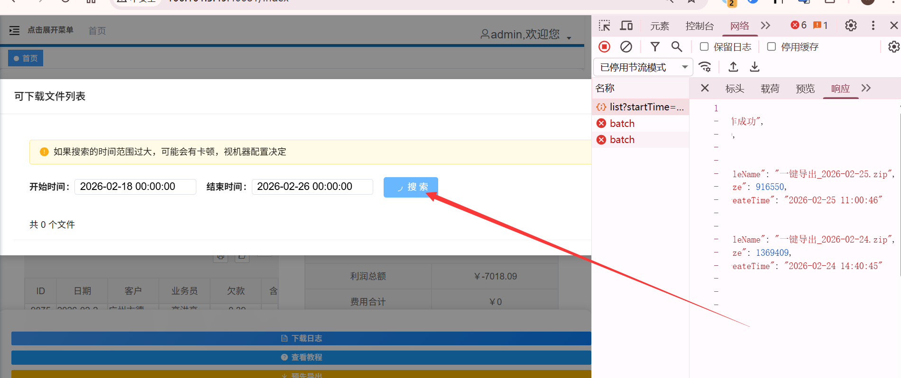
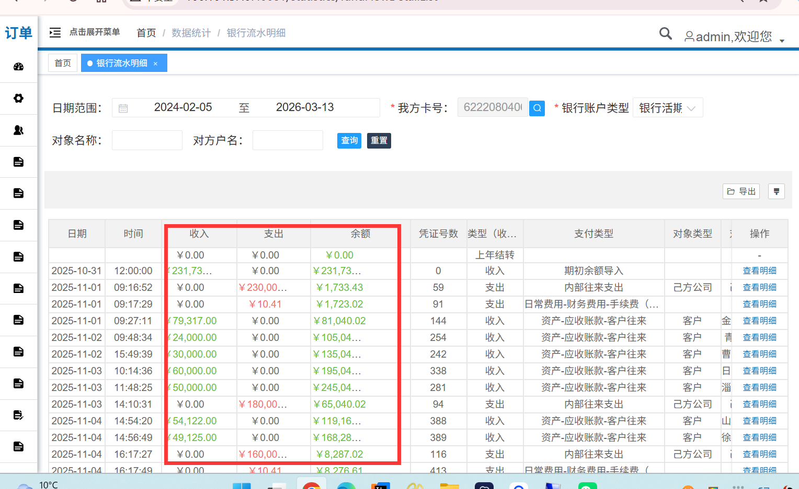
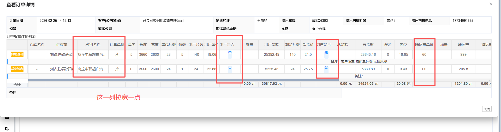
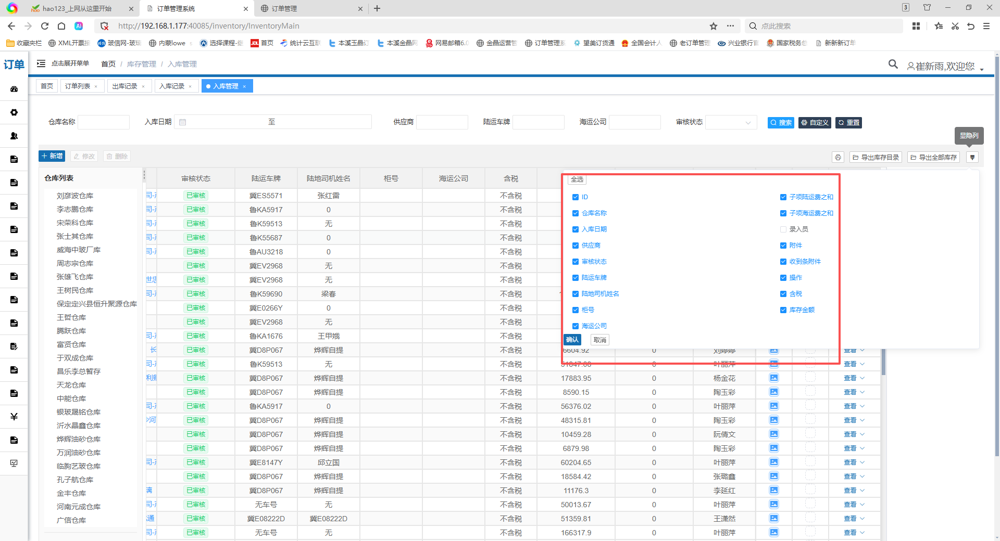

1、冲抵款页面（record/index.vue）修改如下：

GET /system/record/list?pageNum=1&pageSize=20&params[queryAccountType]=银行活期存款

实体类上的 accountType有别的作用，后端太难改了，新的用params传递


2、E:\order-system-ui\packages\order-system\src\views\index.vue中，http://localhost:40080/dev-api/system/allExport/list?startTime=2026-02-18%2000%3A00%3A00&endTime=2026-02-26%2000%3A00%3A00接口，后端已经正常显示了返回结果，但是前端的可下载文件列表弹窗中，搜索按钮一直显示loading效果

```
{
    "msg": "操作成功",
    "code": 200,
    "data": [
        {
            "fileName": "一键导出_2026-02-25.zip",
            "size": 916550,
            "createTime": "2026-02-25 11:00:46"
        },
        {
            "fileName": "一键导出_2026-02-24.zip",
            "size": 1369409,
            "createTime": "2026-02-24 14:40:45"
        }
    ]
}
```




3、银行流水明细这个页面拉开展示不全

接口 GET /statistics/getFundFlowDetailList 新增了一个返回字段 selfAccountName（我方卡户名），类型为 String。
该字段返回当前查询的我方银行卡对应的户名（例如"孙梅-农行"），每条流水记录中都会携带。




4、@毛磊18264410349 红色框的第一列放宽一些，后面三个宽度可以小一些




5、订单列表页面 所有的发货单：
GET /system/goodsOrder/{:id}/sameDayOrders返回的data是一个数组，每个元素和getId接口返回的一致


6、入库管理页面

显隐列和表格列展示的不统一




7、运费申请页面

订单信息弹窗中，订单申请里有两个日期，下边这个日期可以不显示出来，去掉
