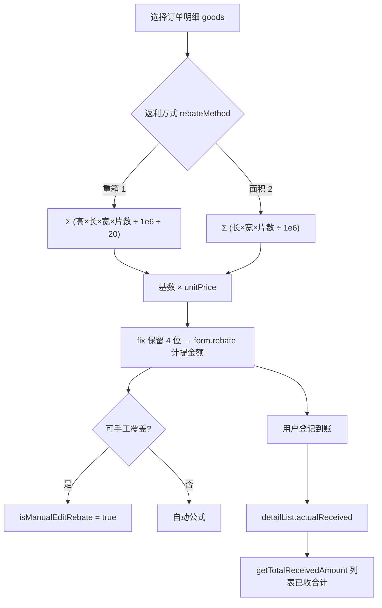

# 供应商返利计算说明

> 来源页面：`packages/order-system/src/views/system/rebate/index.vue`  
> 相关枚举：`packages/order-system/src/api/tool/enums.js` → `RebateType`  
> 精度工具：`packages/order-system/src/api/tool/format.js` → `fix`（保留 4 位小数）  
> 数值运算：统一使用 `mathjs`（`add`、`multiply`、`divide`、`subtract`、`abs`、`number`）

---

## 1. 业务概念区分

| 概念 | 字段 / 位置 | 说明 |
|------|-------------|------|
| **计提返利金额** | `form.rebate` / 列表列「金额」 | 根据选中货物、返利方式、单价**自动计算**，也可手工覆盖 |
| **收到返利金额** | `detailList[].actualReceived` | 用户在实际到账时**逐笔录入**，与计提公式无关 |
| **已收合计** | 列表展示 | `detailList` 中 `actualReceived` 累加 |

计提金额表示「应计多少返利」；流水金额表示「实际收到了多少」。

---

## 2. 返利方式与基数

返利方式决定用 **重箱** 还是 **面积** 作为乘数基数。

| 展示名称 | 前端枚举 `RebateType` | 提交后端值 `rebateMethod` | 基数计算属性 |
|----------|----------------------|---------------------------|--------------|
| 重箱 | `'重箱'`（`Weight`） | `1` | `calculatedWeightBox` |
| 面积 | `'面积'`（`Square`） | `2` | `calculatedArea` |

货物数据来自选中的订单明细 `goods`，每条明细使用字段：`length`（长）、`width`（宽）、`height`（厚）、`pieces`（片数）。

---

## 3. 面积值计算

对每条选中货物：

```
单项面积 = (length × width × pieces) ÷ 1,000,000
```

`calculatedArea` = 所有货物单项面积之和（`reduce` + `mathjs`）。

选完货物并确认后，面积方式会将合计写入 `form.area`。

---

## 4. 重箱值计算

对每条选中货物：

```
单项体积 = (height × length × width × pieces) ÷ 1,000,000
单项重箱 = 单项体积 ÷ 20
```

`calculatedWeightBox` = 所有货物单项重箱之和。

选完货物并确认后，重箱方式会将合计写入 `form.weightBox`。

---

## 5. 计提返利金额（核心公式）

当同时满足：**已选货物**、**已填单价** `unitPrice`、**已选返利方式** `rebateMethod` 时：

```
基数 = 返利方式为「重箱」 ? calculatedWeightBox : calculatedArea
计提金额 rebate = fix(基数 × unitPrice)
```

- `fix`：结果保留 **4 位小数**（`Number(value).toFixed(4)`）
- 表单中通过计算属性 `calculatedRebate` 绑定「金额」输入框

### 5.1 自动计算 vs 手工改金额

由标志位 `isManualEditRebate` 控制：

| 场景 | 行为 |
|------|------|
| 修改单价、修改返利方式、重新选择货物 | `isManualEditRebate = false`，按公式自动计算 |
| 用户在「金额」输入与公式结果不一致的值 | `isManualEditRebate = true`，固定使用手输值 |
| 编辑回显 | 加载 `goods` 后重算；若与服务器 `rebate` 差值 **> 0.01**，视为曾手工修改，保留服务器值 |

提交表单前会将 `calculatedRebate` 同步到 `form.rebate`，并将返利方式转为数字：`重箱 → 1`，`面积 → 2`。

---

## 6. 收到返利流水（实际到账）

「返利」按钮打开弹窗，用户填写 **本次到账金额** 和 **到账日期**，不套用面积/重箱公式。

### 6.1 已收合计（列表展示）

```js
getTotalReceivedAmount(row) {
  // detailList 每条 actualReceived 用 mathjs add 累加
}
```

### 6.2 登记单笔流水时的校验

- `originalAmount`：该条记录的计提金额 `rebate`
- `existingTotal`：已有流水 `actualReceived` 之和
- `newTotal` = `existingTotal + 本次金额`

若 **本次金额 > 计提金额** 或 **累计金额 > 计提金额**，需填写备注后才能提交。

新流水项结构：

```js
{
  actualReceived: 本次金额,
  actualReceivedDate: 到账日期,
  comment: 备注或 null
}
```

流水表「合计」行对 `actualReceived` 同样使用 `mathjs` 累加。

---

## 7. 数据流示意



---

## 8. 关键代码位置

| 逻辑 | 文件位置 |
|------|----------|
| `calculatedArea` / `calculatedWeightBox` / `calculatedRebate` | `index.vue` → `computed` |
| 选货后写入 `weightBox` / `area` / `rebate` | `submitSelectOrderDetail()` |
| 编辑回显与手工判断 | `handleUpdate()` 内 `$nextTick` |
| 提交前同步金额与方式编码 | `submitForm()` |
| 已收合计 | `getTotalReceivedAmount()` |
| 登记流水与超额备注 | `submitRebateForm()` |
| 流水表合计 | `getRebateDetailSummaries()` |
| 货物选择与 `goods` 数据 | mixin `choose_order.js` |

---

## 9. 依赖与约定

1. **高精度**：面积、重箱、金额、流水汇总均使用 `mathjs`，避免浮点误差。
2. **空值处理**：尺寸、片数缺失时按 `0` 参与运算（`number(item.xxx) || 0`）。
3. **类型字段**：业务类型（返利 / 降价 / 售后质量赔偿）为 `rebateType`，与 **返利方式**（重箱/面积）不同，不参与上述乘积公式。
4. **后端字段**：列表展示 `rebateMethod == 2` 为面积，否则为重箱；表单编辑期使用 `RebateType` 字符串，提交时转为 `1` / `2`。

---

## 10. 公式速查

| 项目 | 公式 |
|------|------|
| 单项面积 | `(长 × 宽 × 片数) / 1,000,000` |
| 单项重箱 | `(厚 × 长 × 宽 × 片数) / 1,000,000 / 20` |
| 计提金额 | `fix(Σ单项 × 单价)`，Σ 按返利方式取面积或重箱 |
| 已收合计 | `Σ detailList.actualReceived` |

---

*文档根据前端实现整理，若后端另有校验或舍入规则，以接口与联调结果为准。*
